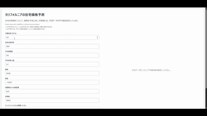
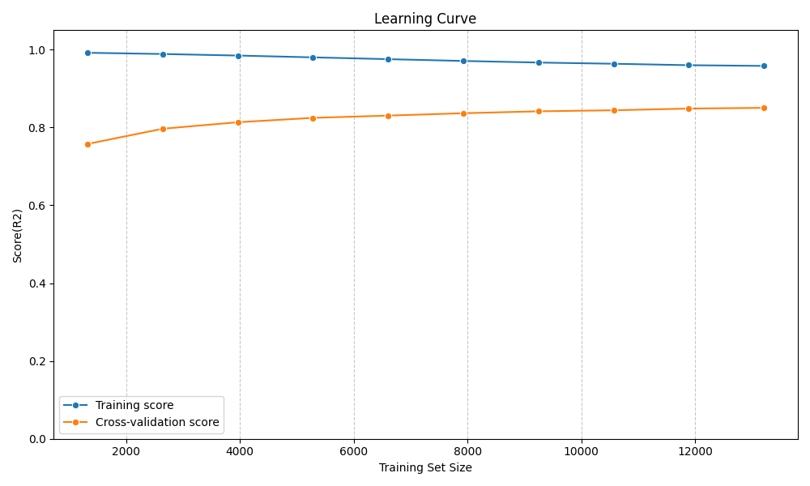

# カリフォルニア住宅価格予測ダッシュボード

住宅の条件を入力するだけで、即座に価格を予測できるインタラクティブなWebアプリです。  

機械学習モデル（LightGBM）による高精度な価格予測に加え、入力に近い実データとの比較プロットにより、予測結果の納得性・信頼性も高めています。

LightGBM で学習させた回帰モデルをFlaskでWeb化し、レスポンシブで見やすいUIを実装しました。

  
条件入力 → 判定結果表示までのデモ

LightGBM モデルの学習曲線。訓練データと検証データで過学習が起きていないことを確認

## 想定ユースケース

- 不動産業界における価格査定支援ツールとして  
- 類似物件との比較による価格設定の参考に  
- Webサービス・アプリケーションのプロトタイプとして活用

## プロジェクトの目的

このプロジェクトは、機械学習モデルの予測結果を「誰でも簡単に体験できる」インタラクティブな Web ダッシュボードとして具現化することを目的としています。

LightGBM によって学習した高精度な回帰モデルを Flask を用いて Web 化し、PC・スマートフォン問わず使いやすい UI を Tailwind CSS で実装しました。

ただ予測値を表示するだけでなく、ユーザーが入力した条件に近い実データとの比較プロットも生成することで、予測結果の妥当性を視覚的に理解できるよう設計しています。

## 成果とプロジェクトの特徴

### 高精度な価格予測  
多数の評価指標で高い性能を示した LightGBM モデルを実装しました。

- **R²スコア**：0.8649  
- **MAE（平均絶対誤差）**：2.79万ドル  
- **RMSE（二乗平均平方根誤差）**：4.20万ドル  
- **MAPE（平均絶対パーセント誤差）**：15.67%

### レスポンシブなUI/UX  
- PC、タブレット、スマートフォンなど、あらゆるデバイスで快適に操作可能  
- Tailwind CSS を用いて統一感と操作性の高い UI を実現  
- 入力条件に似た住宅データとの比較プロットを表示し、**視覚的な信頼性評価**をサポート

## 使用技術と技術選定の理由

| カテゴリ | 技術 | 選定理由 |
|----------------|-----------------|----------------------------|
| AI モデル | LightGBM | 高い予測精度と学習速度の速さに加え、決定木ベースのため前処理が比較的容易で、短期間でのプロトタイプ開発に適しているため。 |
| バックエンド | Flask | 軽量かつシンプルなマイクロフレームワークであり、小規模な Web アプリを迅速に構築可能。予測モデルの API 化にも適している。 |
| フロントエンド | HTML, Tailwind CSS | CSS 記述量を削減し、コンポーネント指向でデザインの統一がしやすく、レスポンシブ対応も効率的なため。 |
| 環境構築 | Python venv | プロジェクトごとに依存関係を分離でき、開発環境の再現性を確保できるため。 |

## 実行方法  
1. 仮想環境のセットアップ  
python -m venv house-venv  
source house-venv/bin/activate  # macOS/Linux  
house-venv\Scripts\activate     # Windows
2. 必要なライブラリをインストール  
pip install -r requirements.txt  
3. モデルの学習と保存  
python train_model.py  
モデルファイル：best_california_housing_model.pkl  
訓練データ情報：california_train_data.pkl  
4. Web アプリケーションを起動  
python app.py  
ブラウザで http://127.0.0.1:5000 にアクセス

## 今後の展望  
- 予測結果のCSV出力機能（営業資料への転用を想定）  
- ユーザーごとの入力履歴保存・再利用機能  
- 地図上での視覚的可視化（Leaflet.js などで表示）  
- 複数地点からの距離特徴量の追加（例：LA, San Diego）  
- モデル解釈の導入（SHAP値の表示など）  
- 入力例プリセット機能（ボタンで実行例を表示）

## ライセンス  
このプロジェクトは[MIT License](LICENSE)の下で公開されています。